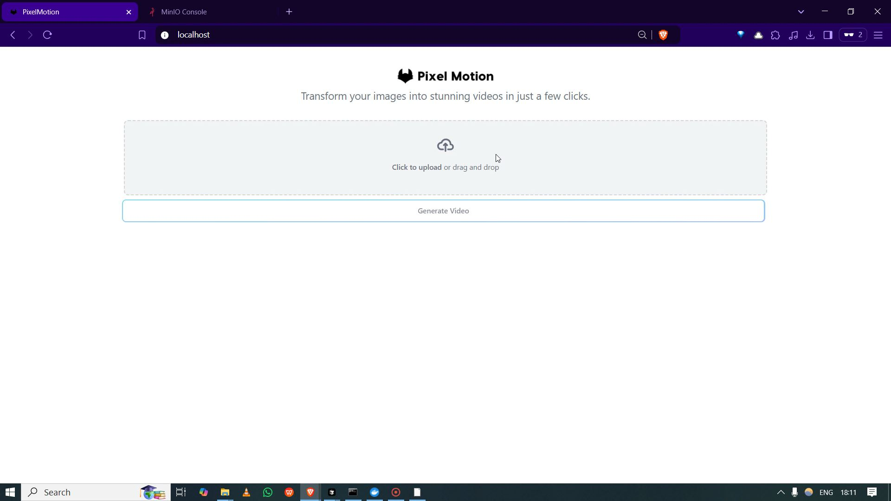
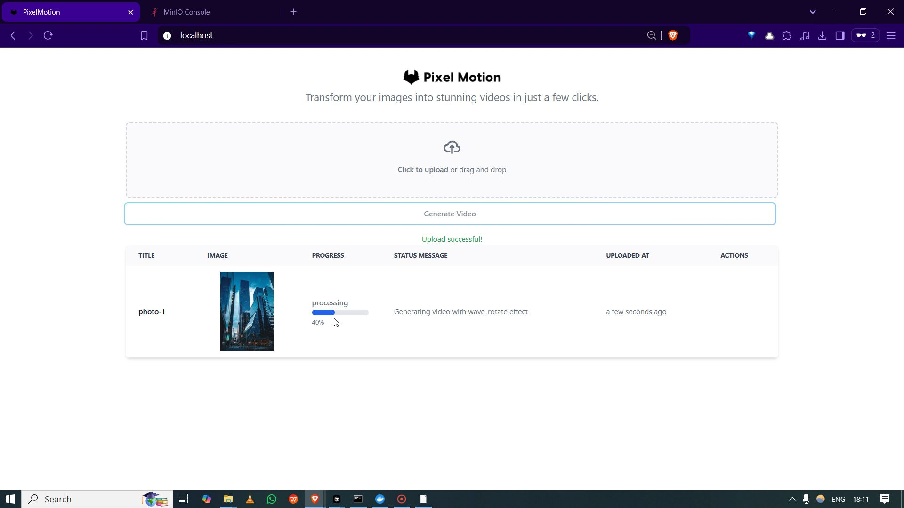
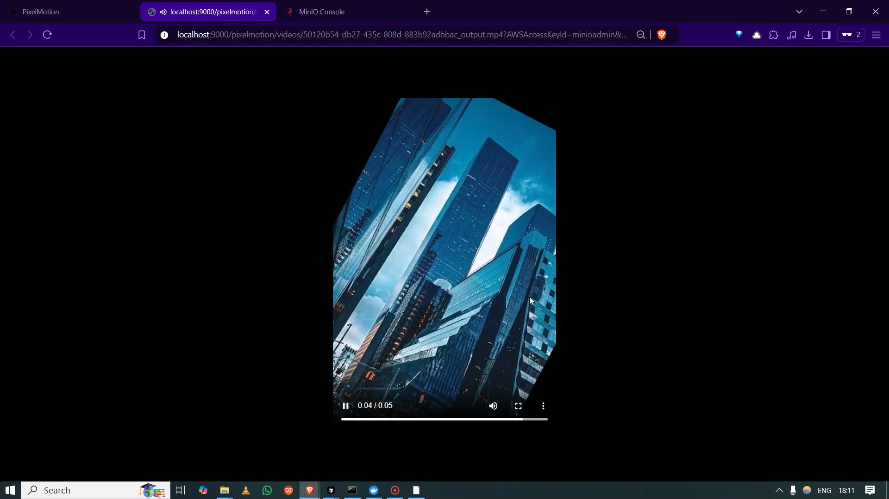
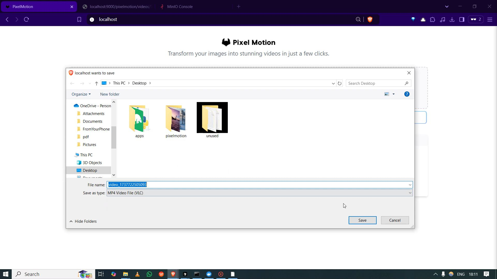
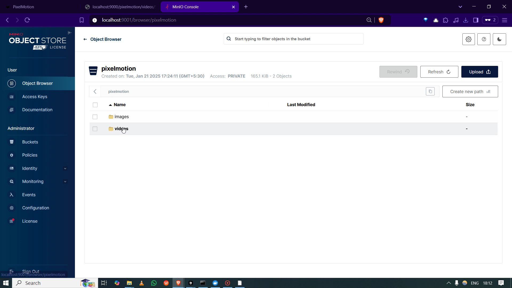
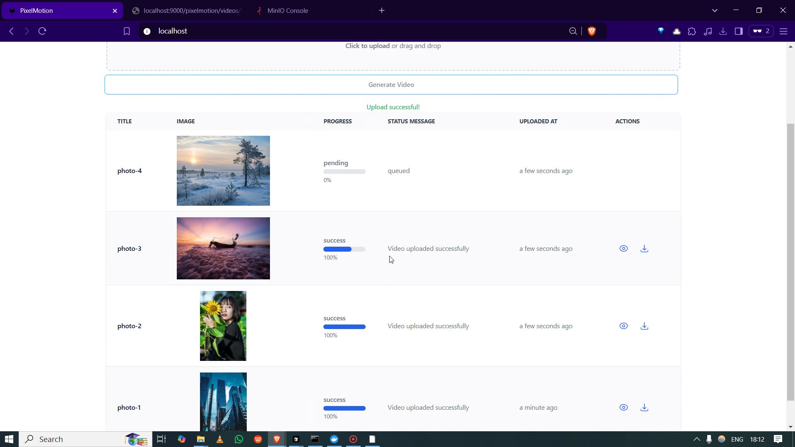
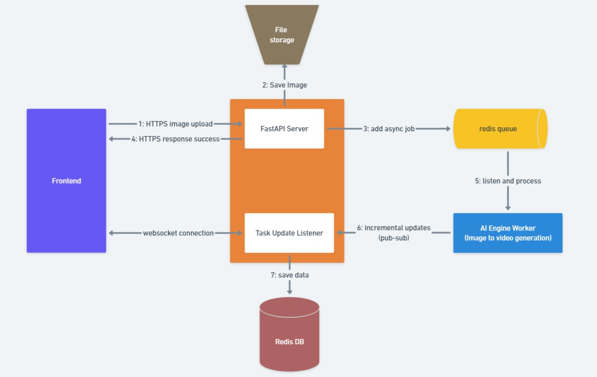

# PixelMotion - Image to video generation tool
A full-stack application built using React, TailwindCSS, FastAPI, Redis, Redis Queue, Docker, and WebSockets. It allows users to generate videos from images with a single click while providing real-time progress updates during the video generation process. The generated videos include animations and background music.

Check out sample generated videos in the [media/samples](./media/samples) folder.

## Media

<video width="320" height="240" controls>
  <source src="./media/pixelmotion_demo.mp4" type="video/mp4">
</video>

### Landing Page

### Pipeline Running

### Generated Video

### Download Video Feature

### Storage Dashboard

### Multiple Images Processing

## Pipeline Diagram
This diagram illustrates the workflow of the image to video generation process

## Features
- Generate videos from images with a single click
- Real-time progress updates during the video generation process
- Animations and background music added to the videos
- Clean and user-friendly interface
- Secure and scalable backend
- Containerized deployment

## Architecture Highlights
- **Microservices Architecture**: The application is built using multiple independent services:
  - Frontend Service (React)
  - Backend API Service (FastAPI)
  - AI Engine Worker Service
  - Redis Service for message queuing and caching
  - MinIO Service for object storage
  
- **Backend Architecture**:
  - FastAPI for high-performance async API
  - Event-driven communication using WebSockets and Redis Pub/Sub
  - Background task processing with Redis Queue
  - Task status tracking and progress updates
  - Secure file storage and retrieval
  - Real-time updates between services

- **Modular Code Organization**:
  - Shared code packaged as `pm_common` Python package
  - Common utilities for Redis, S3, and task management
  - Reusable components across services

- **Scalable Infrastructure**:
  - Docker containerization for all services
  - Redis Queue for distributed task processing
  - MinIO S3-compatible object storage

- **Modern Frontend**:
  - React with TailwindCSS for responsive UI
  - Real-time WebSocket integration
  - Clean component architecture

## Techstack used: 
- React
- TailwindCSS
- Nginx
- WebSockets
- FastAPI
- Redis
- Redis Queue
- Pillow
- MoviePy
- MinIO
- Docker
- Docker Compose
- Python

## Installation
1. Clone the repository
2. Run `docker compose -f docker-compose.yml up` to start the all instances
3. Run `docker compose -f docker-compose.yml down` to stop the all instances
4. Run `docker compose -f docker-compose.yml up --build` to build and start the all instances
5. Frontend will be available at `http://localhost:80/`
6. Backend will be available at `http://localhost:8000/`
7. Minio Object Storage will be available at `http://localhost:9001/`
   - Username: `minioadmin`
   - Password: `minioadminpassword`
8. Redis will be available at `http://localhost:6379/`
